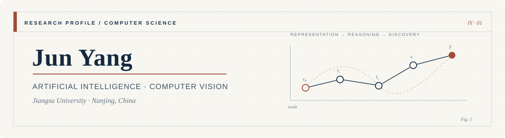

  <picture>
    <source media="(prefers-color-scheme: dark)" srcset="./assets/academic-banner-dark.svg" />
    <source media="(prefers-color-scheme: light)" srcset="./assets/academic-banner-light.svg" />
    
  </picture>

  
<strong>Artificial Intelligence · Computer Vision · Scientific AI</strong>

  

    <a href="mailto:junyang830@foxmail.com">Email</a>
    &nbsp;·&nbsp;
    <a href="https://www.cnblogs.com/yj179101536/">Blog</a>
    &nbsp;·&nbsp;
    <a href="https://github.com/NGIWS830?tab=repositories">Repositories</a>
  

---

## Research Profile

I am an Artificial Intelligence student at the **School of Computer Science and Communication Engineering, Jiangsu University**, based in Nanjing, China. My work focuses on building efficient and reproducible learning systems at the intersection of computer vision and scientific research automation.

I am particularly interested in how architectural inductive bias and feature representation can improve visual recognition under constrained conditions, and how AI agents can support rigorous, traceable scientific workflows.

## Research Interests

| Area | Current focus |
|:---|:---|
| **Computer Vision** | Small-object detection, aerial imagery, visual representation learning |
| **Efficient Deep Learning** | Lightweight architectures, feature diffusion, real-time inference |
| **Transformer Models** | Inductive bias, multi-scale modeling, efficient attention |
| **Scientific AI** | Research agents, reproducible workflows, AI-assisted academic writing |

## Selected Research

### [1] ITNet: Inductive Transformer Network with Diffusion of Feature for UAV Small Object Detection

**Research project** · Computer Vision · PyTorch

An efficient detection architecture for small objects in UAV imagery. ITNet combines a multi-scale backbone, feature-diffusion pyramid, and inductive Transformer design to preserve fine-grained information while maintaining practical inference efficiency.

[`Project repository`](https://github.com/NGIWS830/ITNet) &nbsp;·&nbsp; `VisDrone2019` &nbsp;·&nbsp; `HIT-UAV`

## Research Software

### [S1] AI-SCI-SKILLs — An End-to-End Scientific Writing Pipeline

**Open-source research software** · AI Agents · Reproducible Research

A Chinese-first workflow that organizes source materials, code, experimental results, literature, and research notes into a structured pipeline for scientific manuscript development.

[`Project repository`](https://github.com/NGIWS830/AI-SCI-SKILLs) &nbsp;·&nbsp; `MIT License` &nbsp;·&nbsp; `v0.4.0`

## Methods & Tools

`Python` &nbsp; `PyTorch` &nbsp; `CUDA` &nbsp; `OpenCV` &nbsp; `Transformer Architectures` &nbsp; `Object Detection` &nbsp; `Research Agents`

## Contact

For research discussion, reproducibility questions, or potential collaboration:

- **Email:** [junyang830@foxmail.com](mailto:junyang830@foxmail.com)
- **Affiliation:** Jiangsu University, Nanjing, China
- **Writing:** [博客园 / CNBlogs](https://www.cnblogs.com/yj179101536/)

---

  <em>关山难越，步履不停。</em>

